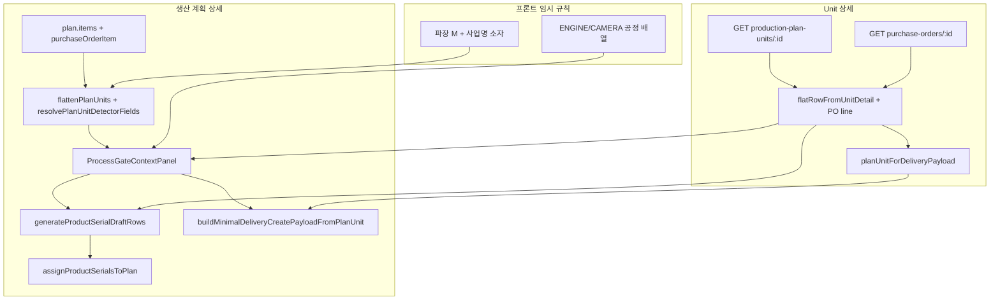

# 공정 처리·시리얼·납품 — 프론트 임시(하드코딩) 정리

> **상태:** 백엔드·공통코드 정본 도입 전 **프론트 임시 규칙**이 여러 겹으로 동작합니다.  
> 개선 시 이 문서의 체크리스트와 파일 인덱스를 기준으로 제거·통합하세요.  
> LOT/시리얼 API 흐름만 보려면 [frontend-production-plan-lot-serial.md](./frontend-production-plan-lot-serial.md).

---

## 1. 임시 로직 4축

| 축 | 내용 | 정본이 되어야 할 것 |
|----|------|---------------------|
| **A. 제품군별 공정 경로** | 엔진 vs 카메라 단계 배열·진행률 | 제품 정의 / BOM / 공정 템플릿 API |
| **B. 검출기 소자·파장** | 파장 `M`, 소자는 사업명 스냅샷에서 파생 | 발주 라인·Unit API·공통코드 |
| **C. 제품 시리얼 채번** | legacy 규칙 + 제품·검출기 마스터 조회 | `assign-product-serials`·시리얼 정책 |
| **D. 공정 단계별 UI** | 입고·포장·출고준비 코드 분기 | `UNIT_PROCESS_STEP` + 백엔드 상태 |

---

## 2. 파일 인덱스

### A. 엔진/카메라 공정 경로

| 파일 | 심볼 | 용도 |
|------|------|------|
| `src/domains/production-plan/helpers/detailHelpers.ts` | `SHARED_PREFIX_PROCESS_CODES`, `ENGINE_PROCESS_CODES`, `CAMERA_PROCESS_CODES`, `SHARED_SUFFIX_PROCESS_CODES` | 공정 코드 배열(프론트 상수) |
| ↑ | `isEngineLikePlanUnitRow` | 텍스트에 `ENGINE`/`엔진` 포함 시 엔진 경로 |
| ↑ | `buildProcessStepCodesForPlanUnitRow` | 스테퍼·모달 표시 공정 순서 |
| ↑ | `flattenPlanUnits` | 생산 계획 → `FlatPlanUnitRow[]` |
| ↑ | `computeProductionPlanUnitStats` | 계획 상세 진행률 |

**호출 화면:** `ProductionPlanDetail`, `ProductionPlanDetailOverviewTab`, `ProcessGateContextPanel`, `UnitDetail`, `UnitOverviewTab`(진행 표시만)

### B. 소자·파장 보정

| 파일 | 심볼 | 용도 |
|------|------|------|
| `src/domains/order/helpers/orderLineDetectorFields.ts` | `ORDER_LINE_WAVELENGTH_CODE` (`"M"`) | 발주 UI 비노출 파장 |
| ↑ | `detectorElementCodeFromBusinessName`, `defaultHiddenDetectorCodesForProduct` | **발주 등록** 숨김 필드 |
| `src/domains/production-plan/helpers/detailHelpers.ts` | `resolvePlanUnitDetectorFields` | **생산·Unit 공정** 보정(발주와 동일 규칙) |
| `src/domains/production-plan/serial/legacyProductSerialNumber.ts` | `resolveDetectorElementCodeForSerial`, `generateProductSerialDraftRows` | 시리얼 초안 채번 |

**`resolvePlanUnitDetectorFields` 호출처**

- `flattenPlanUnits` — 계획 Unit 테이블 `flatRow`
- `flatRowFromUnitDetail` — Unit 상세 `flatRow`
- `UnitDetail` / `ProductionPlanDetail` — 엔진 포장 PASS → `assignProductSerialsToPlan` 직전

**발주 전용(별도 경로, 통합 후보)**

- `OrderForm.tsx`, `OrderDetail.tsx`
- `src/domains/production-plan/helpers/serialFromOrderLine.ts` — `resolveOrderLineWavelengthCode`

### C. Unit 상세 보강 레이어

| 파일 | 심볼 | 용도 |
|------|------|------|
| `src/domains/production-plan/mappers/unitMappers.ts` | `flatRowFromUnitDetail(detail, purchaseOrderItem?)` | 공정·시리얼용 `FlatPlanUnitRow` — **PO 품목 없으면 `productId` 없음** |
| ↑ | `planUnitForDeliveryPayload` | 납품 API용 Unit 병합 |
| ↑ | `findPurchaseOrderItemForUnit`, `customerCodeForUnitDetail` | 발주 조회·거래처 코드 |
| `src/pages/UnitDetail.tsx` | `getPurchaseOrder` + 위 매퍼 | Unit API만으로는 시리얼/납품 불완전 → 발주 품목 조회 |

**주의:** `UnitOverviewTab`은 `flatRowFromUnitDetail(unit)`만 호출(발주 품목 미조회) — **진행률·공정 개수 표시용**. 공정 모달·시리얼·납품과 데이터 소스가 다를 수 있음.

### D. 공정 모달 UI 분기

| 파일 | 내용 |
|------|------|
| `src/api/commonCode.ts` | `UNIT_PROCESS_STEP_CODE_*` 상수 |
| `src/components/delivery/ProcessGateContextPanel.tsx` | 입고=검출기 S/N, 포장=제품 시리얼, 출고준비=납품 안내 |
| `src/pages/ProductionPlanDetail.tsx` | PASS/FAIL, 시리얼 자동생성, 납품 모달 |
| `src/pages/UnitDetail.tsx` | 동일 패턴 + `planUnitForDeliveryPayload` |
| `src/components/delivery/ProductionPlanDetailOverviewTab.tsx` | 출고준비 시 「납품 등록」 vs 「공정 처리」 |

### E. 납품 등록

| 파일 | 심볼 |
|------|------|
| `src/domains/production-plan/helpers/registerFromPlanUnit.ts` | `buildMinimalDeliveryCreatePayloadFromPlanUnit` — `unit.serialNo`, `detectorElementCode`, `wavelengthCode` 필수 |

- 생산 계획: `deliverModal.unit`(계획 API Unit)
- Unit 상세: `planUnitForDeliveryPayload(processUnit, flatRow)`

---

## 3. 화면별 데이터 흐름

---

## 4. 기술 부채(통합 후보)

1. **`detectorElementCodeFromBusinessName`** — `orderLineDetectorFields.ts`와 `legacyProductSerialNumber.ts`에 유사 구현 중복.
2. **소자·파장 해석 3갈래** — `defaultHiddenDetectorCodesForProduct`(발주), `resolveOrderLineDetectorPayload`, `resolvePlanUnitDetectorFields`(생산) → 단일 `resolveDetectorContext` 검토.
3. **`isEngineLikePlanUnitRow`** — 문자열 매칭 → `productType` / definition 메타.
4. **Unit 상세 이중 조회** — Unit API에 `productId`·소자·파장 확정값이 내려오면 `getPurchaseOrder` 보강·`planUnitForDeliveryPayload` 축소.

---

## 5. 개선 체크리스트

- [ ] `GET /production-plan-units/:id`에 `productId`, `detectorElementCode`, `wavelengthCode`, `detectorId` 포함
- [ ] 제품군별 공정 경로를 API·공통코드 그룹으로 이전 (`ENGINE_PROCESS_CODES` 등 제거)
- [ ] `isEngineLikePlanUnitRow` 제거, 제품 메타 기반 분기
- [ ] 발주·생산·납품 소자/파장 해석 단일 모듈화
- [ ] `UnitOverviewTab`과 `UnitDetail`의 `flatRow` 데이터 소스 일치
- [ ] 회귀: 엔진 포장 → 시리얼 → 출고준비 → 납품 (계획 상세 vs Unit 상세)

---

## 6. 수동 테스트 시나리오

1. 생산 계획 상세 — 엔진 Unit — 공정 처리 — 포장에서 시리얼 생성 — PASS — 납품 등록  
2. Unit 상세 — 동일 Unit — 동일 흐름(시리얼·납품 오류 없음)  
3. 카메라 Unit — 스테퍼 단계 수·진행률이 엔진과 다르게 보이는지  
4. Unit API에 소자·파장 비어 있고 발주 품목에만 있을 때 — 납품 등록 성공 여부
